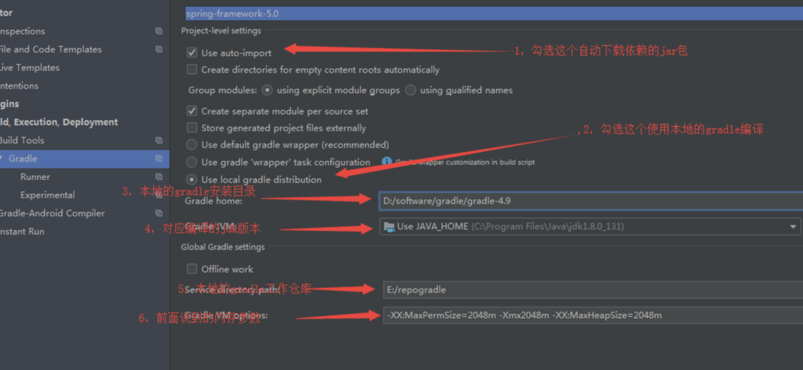

前提：jdk1.8 gradle5.4 idea

### gradle的安装
传送门 [](https://services.gradle.org/distributions/)
src.zip 源码文件 bin.zip 安装文件 all.zip 源码文件+安装文件，只需要下载安装文件即可

### spring-framework项目下载
再github上找到开源项目spring-framework,然后下载到本地


### idea配置
用idea打开解压后的项目，然后配置idea

指定gradle的安装路径
增加内存大小，防止编译时，内存不足


等待gradle下载完成全部依赖。

### 自定义module
右击项目名，新建module。注意：不要从file中新建module。
建立完成后引入自己想使用的spring依赖。如下：
```
compile(project(":spring-context"))
```
然后编写相关代码，如下：
```java
public class BootStrap{
    public static void main(String[] args){
      AnnotationConfigApplicationContext context = new AnnotationConfigApplicationContext();
      context.refresh();
      context.close();
    }
}
```

个人再运行5.1.x时，出现了一个错误，显示instrument错误，把spring-context中的gradle文件
```
optional(project(":spring-instrument"))
```
改为：
```
compile(project(":spring-instrument"))
```
即可运行成功！